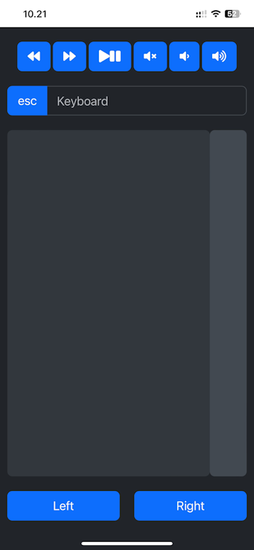

# PCRemoteControl

A windows application that makes it possible to control the keyboard and mouse on the PC remotely from a browser.

Below is a screenshot of the PWA app running on the phone.



## Publish executable

Publish the PCRemoteControl project using a folder profile with settings like theese:

```
<?xml version="1.0" encoding="utf-8"?>
<!--
https://go.microsoft.com/fwlink/?LinkID=208121.
-->
<Project>
  <PropertyGroup>
    <DeleteExistingFiles>true</DeleteExistingFiles>
    <ExcludeApp_Data>false</ExcludeApp_Data>
    <LaunchSiteAfterPublish>true</LaunchSiteAfterPublish>
    <LastUsedBuildConfiguration>Release</LastUsedBuildConfiguration>
    <LastUsedPlatform>Any CPU</LastUsedPlatform>
    <PublishProvider>FileSystem</PublishProvider>
    <PublishUrl>bin\Release\net7.0\publish\</PublishUrl>
    <WebPublishMethod>FileSystem</WebPublishMethod>
    <_TargetId>Folder</_TargetId>
    <SiteUrlToLaunchAfterPublish />
    <TargetFramework>net7.0</TargetFramework>
    <RuntimeIdentifier>win-x64</RuntimeIdentifier>
    <PublishSingleFile>true</PublishSingleFile>
    <PublishReadyToRun>true</PublishReadyToRun>
    <ProjectGuid>[GUID]</ProjectGuid>
    <SelfContained>false</SelfContained>
  </PropertyGroup>
</Project>
```

## Running executable

Before running the application make sure to:

* Download and install the .NET 7 runtime:
https://aka.ms/dotnet-core-applaunch?missing_runtime=true&arch=x64&rid=win10-x64&apphost_version=7.0.12

* Download and install the .NET 7 framework:
https://aka.ms/dotnet-core-applaunch?framework=Microsoft.AspNetCore.App&framework_version=7.0.0&arch=x64&rid=win10-x64

* Set the listening port:
In the "appsettings.json" file you are able to specify which port the PC is listening on.
Default is "8080".

* Consider giving the PC a static ip.

* Also consider making a shortcut to the executable and place the shortcut in the "shell:startup" folder.
(press Win+R, write "shell:startup" and press enter, to open the folder)
This will make the application run when the user logs on.

* Run the executable: "PCRemoteControl.exe".

* Make a firewall rule on the PC so the application is able to be reached from other devices on the network.

## Connect to the PC through the browser on your phone

* Connect your smart phone / device to the same network as the PC.

* Open up the browser on your phone and connect to the PC using the ip and listening port:
Ex: "http://192.168.1.200:8080".

* Install the PWA app to the home screen so it is easy to find and use.
Using it as a PWA app will also make it fill the screen so the browser stuff is not visible.